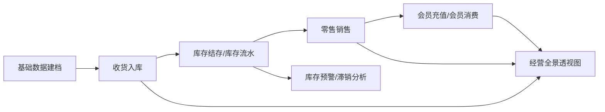

# 小型独立书店离线进销存系统开发需求文档

## 文档信息

| 项目     | 内容                                                                      |
| -------- | ------------------------------------------------------------------------- |
| 文档名称 | 小型独立书店离线进销存系统开发需求文档                                    |
| 文档版本 | v1.1                                                                      |
| 编写日期 | 2026-04-04                                                                |
| 适用项目 | `bookstore_management_system`                                             |
| 参考来源 | 现有 Flutter 项目、`docs/database` 中的数据库建议稿、上传的老系统界面照片 |
| 部署目标 | 小型独立书店单店商用、完全离线、本地部署运行                              |

## 0. 背景与现状

本项目目标不是简单复刻老式书店软件界面，而是结合当前 Flutter 桌面项目能力，建设一个适合小型独立书店长期使用的离线进销存系统。

从上传的照片可以提炼出老系统的核心模块分布：

- 基础数据：商品资料、客户资料、供应商资料、人员资料、购销方式、会员资料、会员卡类型、会员卡充值、会员折扣决策库等。
- 订收管理：收货单、收货退货单，以及若干订货、客户订货、对账、接口类能力。
- 销售管理：零售、批销、发票、会员消费统计等。
- 统计分析：综合查询、经营全景透视图、畅销/滞销分析、库存临界点、经营排行等。
- 系统管理：权限、参数、数据维护、接口工具、初始化、备份恢复等。

结合当前仓库代码，项目已经具备以下基础：

- 已有桌面端应用壳和多窗口能力。
- 已有登录模块与本地用户表。
- 已有商品资料录入、查询、编辑的基础页面。
- 已使用本地 SQLite（Drift）和 Hive，本地运行基础成熟。
- 已具备局域网内移动端/扫码端发现与 ISBN 回传的技术基础。

当前明显缺失的商用闭环能力包括：

- 真正的库存结存与库存流水。
- 收货入库、收货退货等采购侧单据。
- 零售开单、收款、退货、日结。
- 会员充值、储值消费、折扣规则引擎。
- 综合经营报表与预警体系。

因此，本需求文档以“能在小型独立书店落地商用”为第一原则，强调先完成最小闭环，再逐步扩展复杂功能。

## 1. 项目目标与范围

### 1.1 项目目标

本系统应支持一家小型独立书店在无互联网条件下完成日常经营，覆盖“商品建档 -> 收货入库 -> 库存管理 -> 零售销售 -> 会员经营 -> 经营分析 -> 本地备份”的核心闭环。

核心目标如下：

1. 在 Windows 桌面端完全离线运行，不依赖云端服务。
2. 满足单店场景下的图书商品资料管理、进货收货、零售收银、会员储值和经营分析。
3. 保证数据可追溯，单据、库存、价格、折扣、操作员均有记录。
4. 能让 1 到 5 人规模的门店团队直接投入使用，并支持后续逐步扩展。

### 1.2 业务范围

首期业务范围以“小型独立书店单店经营”定义：

- 经营主体：1 家门店。
- 仓库模型：1 个主库存仓，可扩展货架位；首期不强制多仓调拨。
- 商品范围：以图书为主，可兼容文创、杂志、非书商品。
- 客户范围：散客、会员、团购客户。
- 供应链范围：供应商供货、收货、退货。
- 销售范围：线下零售为主，支持会员消费与退货。

### 1.3 首期必不可少的关键功能

以下功能判定为书店首期投入商用的必需能力：

| 优先级 | 模块              | 说明                                       |
| ------ | ----------------- | ------------------------------------------ |
| P0     | 登录与权限        | 至少区分管理员、店长、营业员，保证操作留痕 |
| P0     | 商品资料          | 图书档案、定价、ISBN、出版社、分类、货架位 |
| P0     | 供应商资料        | 支撑收货和退货                             |
| P0     | 会员资料          | 支撑会员识别、储值、折扣                   |
| P0     | 收货单            | 进货入库的正式入口                         |
| P0     | 收货退货单        | 采购退货与库存回退                         |
| P0     | 零售管理          | POS 收银、改价权限、支付记录、小票打印     |
| P0     | 销售退货          | 商用门店不可缺失                           |
| P0     | 库存结存/库存流水 | 没有库存台账就无法形成进销存               |
| P0     | 基础统计          | 综合查询、畅销/滞销分析、经营全景透视图    |
| P0     | 本地备份恢复      | 离线本地软件必须保障可恢复性               |

以下功能建议作为增强能力，但不应阻塞首期上线：

| 优先级 | 模块                             | 建议                                           |
| ------ | -------------------------------- | ---------------------------------------------- |
| P1     | 订货单/客户预订                  | 有助于规范采购计划，但不是首期必需             |
| P1     | 盘点单                           | 首期可以先提供手工库存调整，后续再做正式盘点单 |
| P1     | 标签打印/书签打印                | 对门店效率有价值                               |
| P1     | 会员生日提醒/营销提醒            | 可提升复购，但不是开业阻塞项                   |
| P1     | 局域网移动扫码录入               | 当前项目已有技术基础，建议保留                 |
| P2     | 多仓调拨                         | 小店初期一般不需要                             |
| P2     | 租书、复杂财务单据、批量对外接口 | 照片中有痕迹，但不建议首发即做                 |
| P2     | 跨门店同步/云备份                | 与“完全离线单店”目标冲突，后续再评估           |

### 1.4 与现有项目结合的开发范围

当前 Flutter 项目可直接复用或延展的部分：

- 登录页与本地用户体系可以继续保留，但需要补足角色与权限粒度。
- 商品资料页面可作为“商品主数据中心”的首个落地模块继续迭代。
- 本地 SQLite 和 Hive 方案适合继续承载离线业务。
- 商品查询/编辑页已经接近老系统中“商品资料”界面的基础形态。
- 局域网 ISBN 接收能力可演进成“移动扫码入录/盘点辅助输入”。

需要新增或重构的范围：

- 数据库从“商品资料库”扩展为“商品主数据 + 库存台账 + 单据流水 + 会员账户”。
- `inventory` 模块从占位页升级为真实库存业务模块。
- 新增采购收货、销售、会员、统计、系统管理模块。
- 将金额、折扣、状态、角色等数据统一编码，避免文本散落。

## 2. 用户角色与核心流程

### 2.1 用户角色

| 角色          | 典型人员         | 核心职责                                     | 核心权限                     |
| ------------- | ---------------- | -------------------------------------------- | ---------------------------- |
| 系统管理员    | 老板/技术负责人  | 参数配置、权限设置、备份恢复、初始化         | 全部                         |
| 店长          | 店主/门店负责人  | 商品审核、价格管理、经营分析、日结复核       | 大部分核心功能               |
| 营业员/收银员 | 门店店员         | 零售开单、会员识别、收款、小票打印、退货受理 | 零售、会员查询、有限改价     |
| 采购/收货员   | 店员兼采购       | 收货单、收货退货单、供应商资料维护           | 采购侧单据、供应商、库存查询 |
| 仓管员        | 小店可与采购重叠 | 库存调整、货架位维护、库存预警、盘点         | 库存模块                     |

说明：

- 小型独立书店中一个人可能同时兼任多个角色，因此系统既要支持细粒度权限，也要支持“店长兼管理员”的组合使用方式。
- 首期角色设计应支持“按角色授权 + 按功能点禁用”，不要求做到非常复杂的组织架构。

### 2.2 核心业务流程

#### 流程一：商品建档与上架

1. 管理员或店长创建商品分类、出版社、购销方式等基础字典。
2. 录入商品资料，支持 ISBN 扫描带入、自编码录入、封面图片维护。
3. 设置零售价、进价、会员折扣、默认货架位、库存上下限。
4. 商品启用后可参与收货、销售和统计。

#### 流程二：收货入库

1. 收货员选择供应商并创建收货单。
2. 录入或扫描商品，填写到货数量、进价、折扣、备注。
3. 审核/过账后生成库存流水，更新库存结存。
4. 若与供应商存在差异，可记录短缺、赠书、折让等备注。

#### 流程三：零售销售

1. 营业员打开零售界面，扫描图书 ISBN 或搜索商品。
2. 系统根据商品价格、会员身份、折扣决策库计算应收金额。
3. 选择支付方式完成收款，系统扣减库存并生成销售单与销售流水。
4. 打印小票并保留单据追溯。

#### 流程四：退货处理

1. 对供应商退货时创建收货退货单，系统冲减库存。
2. 对顾客退货时引用原销售单或按规则手工退货，系统回补库存并冲减营业额。
3. 退货必须记录原因、操作员、时间和关联原单。

#### 流程五：会员经营

1. 新会员建档，绑定手机号、会员卡类型。
2. 会员充值时生成充值流水并更新储值余额。
3. 会员消费时自动套用会员折扣规则，可混合储值与其他支付方式。
4. 店长可查询会员充值、消费、余额与活跃度。

#### 流程六：经营分析与日常管理

1. 店长查看综合查询、畅销/滞销分析、经营全景透视图。
2. 仓管员查看库存预警、滞销库存、库存流水。
3. 管理员按日或按周执行本地备份，并可在异常时恢复。

### 2.3 核心流程总览

## 3. 详细功能需求

### 3.1 基础数据

本模块参考照片中的“基础数据”菜单，并结合当前商品模块现状扩展。

#### 3.1.1 商品资料

目标：建立统一的图书主数据中心，供采购、销售、库存、会员折扣等模块复用。

功能要求：

- 支持新增、编辑、查询、作废、启用商品资料。
- 支持 ISBN 扫码录入、自编码录入、名称模糊搜索。
- 支持按商品编码、ISBN、书名、作者、出版社、分类、货架位查询。
- 支持维护商品封面图片和基础图片占位。
- 支持 Excel/CSV 导入导出。
- 支持查询结果导出与批量打印标签。

商品核心字段：

| 字段            | 是否必填   | 说明                           |
| --------------- | ---------- | ------------------------------ |
| 商品编码/SKU    | 是         | 系统内唯一编码                 |
| 自编码          | 否         | 门店内部编码，可为空但建议唯一 |
| ISBN            | 对图书必填 | 非图书可为空；非空时应唯一     |
| 商品名称        | 是         | 主显示名称                     |
| 副标题          | 否         | 可选                           |
| 作者            | 是         | 可存文本                       |
| 出版社          | 是         | 引用出版社资料                 |
| 商品分类        | 是         | 引用商品分类                   |
| 图书属性        | 否         | 普通图书、新书、重点书、教辅等 |
| 包装/装帧       | 否         | 精装、平装等                   |
| 出版日期/出版年 | 否         | 用于资料查询                   |
| 进价            | 否         | 默认采购价格                   |
| 零售价          | 是         | 终端销售价格                   |
| 批发价          | 否         | 后续批销扩展用                 |
| 零售折扣        | 是         | 默认 100%                      |
| 会员折扣        | 是         | 默认 100% 或由规则库覆盖       |
| 购销方式        | 否         | 普通销售、会员特价、寄售等     |
| 默认货架位      | 否         | 用于找书和盘点                 |
| 库存上限/下限   | 否         | 预警阈值                       |
| 状态            | 是         | 启用、停用、作废               |
| 创建人/修改人   | 是         | 审计字段                       |

关键业务规则：

1. 商品主数据与库存数量必须分离，库存数量不得通过重复商品行表达。
2. 金额字段统一按“分”存储，界面按元显示。
3. 折扣字段统一按整数百分比基点或千分比基点存储，不直接使用浮点数。
4. 停用商品不能参与新开单，但可保留历史查询。

#### 3.1.2 客户资料

目标：支撑散客挂账、团购客户、学校/机构采购等场景。

功能要求：

- 维护客户基本信息、联系人、联系电话、地址、备注。
- 支持客户类型区分：散客、会员、团购客户、单位客户。
- 支持客户历史消费与历史退货查询。
- 首期不强制做应收账龄，但应保留后续扩展字段。

#### 3.1.3 供应商资料

目标：支撑收货单、退货单、采购分析。

功能要求：

- 维护供应商编码、名称、联系人、电话、地址、结算方式、状态。
- 支持按供应商查询收货历史、退货历史、采购金额汇总。
- 支持停用供应商但保留历史单据。

#### 3.1.4 人员资料

目标：支撑登录、权限、操作员追溯、销售员统计。

功能要求：

- 维护员工账号、姓名、手机号、角色、状态、备注。
- 支持启用、停用、重置密码。
- 支持按人员查看销售记录、收货记录、库存调整记录。

#### 3.1.5 购销方式

目标：把照片中“购销方式”类配置从文本输入改为基础字典。

首期建议支持：

- 普通零售
- 会员价销售
- 团购/批销
- 寄售
- 特价清仓

规则：

- 购销方式可配置默认折扣、是否允许积分、是否允许退货、是否需要审批。

#### 3.1.6 会员资料

目标：支持书店会员识别、储值、消费分析。

功能要求：

- 建立会员档案：姓名、手机号、会员编号、卡类型、状态、生日、备注。
- 支持手机号、会员号快速检索。
- 支持会员绑定客户资料。
- 支持查看累计充值、累计消费、当前余额、最近消费时间。

#### 3.1.7 会员卡类型

目标：把会员权益标准化。

功能要求：

- 配置普通会员、储值会员、金卡会员等卡类型。
- 可设置默认折扣、是否允许充值、是否有开卡费、是否有积分规则。
- 支持卡类型停用，不影响已有会员历史。

#### 3.1.8 会员卡充值

目标：让会员储值成为正式账务行为，而不是备注行为。

功能要求：

- 支持会员充值、充值撤销、充值流水查询。
- 支持现金、微信、支付宝、银行卡等充值方式。
- 支持设置赠送金额或充值活动，但首期活动规则可简化。
- 充值完成后即时更新会员余额。

关键规则：

1. 充值必须生成单据号和流水记录。
2. 已被消费的充值记录不得直接删除，只能冲正。

#### 3.1.9 会员折扣决策库

目标：实现照片中“会员折扣决策库”的可配置化，而不是把折扣硬编码在商品表中。

功能要求：

- 支持按会员卡类型设置全场默认折扣。
- 支持按商品分类设置差异化折扣。
- 支持按商品单品设置专属会员价或专属折扣。
- 支持设置生效时间区间。
- 支持优先级计算。

建议优先级：

1. 手工指定单品会员价
2. 单品会员折扣
3. 分类会员折扣
4. 卡类型默认折扣
5. 商品主数据默认会员折扣

### 3.2 订收管理

照片中“订收管理”菜单较长，但对于首期商用必须优先完成的是“收货单”和“收货退货单”。

#### 3.2.1 收货单

目标：规范供应商到货入库，形成库存增长和采购台账。

单头字段：

| 字段          | 说明                 |
| ------------- | -------------------- |
| 单据号        | 自动生成，可检索     |
| 单据日期      | 默认当前日期         |
| 供应商        | 必填                 |
| 收货仓库      | 首期默认主仓         |
| 经手人/收货员 | 必填                 |
| 单据状态      | 草稿、已过账、已作废 |
| 备注          | 可选                 |

单体字段：

| 字段   | 说明               |
| ------ | ------------------ |
| 商品   | 支持扫码或搜索     |
| 数量   | 必填，正整数       |
| 单价   | 可默认带出商品进价 |
| 折扣   | 默认 100%          |
| 金额   | 自动计算           |
| 货架位 | 可选带入           |
| 备注   | 可选               |

处理流程：

1. 新建草稿。
2. 录入商品行。
3. 保存草稿或直接过账。
4. 过账后生成库存流水 `purchase_in`，更新库存结存。
5. 过账后默认不可直接修改，只能红冲或作废重开。

关键规则：

1. 收货单过账后，库存应立即可售。
2. 如果商品不存在，允许在收货过程中快速新建商品，但需有权限控制。
3. 同一单据总额、总数量自动汇总。
4. 首期不强制采购订单前置，但需保留后续关联采购订单的字段。

#### 3.2.2 收货退货单

目标：处理对供应商退货、质量问题退回、错收退回等场景。

功能要求：

- 支持引用原收货单创建退货单，也支持独立创建。
- 退货数量不得超过当前可退数量或当前库存可退数量。
- 过账后生成库存流水 `return_out` 或 `purchase_return_out`。
- 支持记录退货原因：质量问题、错发、滞销退回、其他。

关键规则：

1. 退货单必须记录供应商、商品、数量、单价、原因、操作员。
2. 若已触发对账或财务结算，是否允许退货需由权限控制。

#### 3.2.3 订货与客户预订

结合照片里的订货单、客户订货相关菜单，建议这样分期：

- 首期：只保留“预留数据结构 + 不阻塞收货单使用”。
- 增强版：增加采购建议单、客户预订单、订货汇总。

原因：

- 小型独立书店首期先解决“到货能入库、卖出能扣库”更关键。
- 订货计划类功能虽然有用，但不应阻塞核心闭环上线。

### 3.3 销售管理

#### 3.3.1 零售管理

目标：构建门店高频使用的收银界面，支持扫码卖书、会员识别、折扣结算和小票打印。

功能要求：

- 支持 ISBN/条码枪扫描录入商品。
- 支持按书名、ISBN、作者、商品编码搜索商品。
- 支持修改数量、删除行、整单取消。
- 支持识别会员并自动带出折扣/储值余额。
- 支持多支付方式：现金、微信、支付宝、银行卡、会员储值、混合支付。
- 支持手工改价、整单折扣、行级折扣，但需权限控制。
- 支持打印小票和重打小票。
- 支持挂单/取单作为增强功能。
- 首选支持 HID 键盘模拟模式扫码枪，扫码后按整串内容提交，不以逐字符监听作为核心处理方式。
- 扫码枪建议支持自动追加 Enter/Tab 后缀；系统应支持持续聚焦的输入框或收银主输入区。
- 摄像头扫码保留为备用方案，不作为首期主要收银输入方式。

销售单字段建议：

- 单据号
- 销售时间
- 收银员
- 会员/客户
- 销售渠道
- 商品行、数量、原价、折扣、实付
- 支付方式、支付金额
- 优惠金额、抹零金额
- 备注

关键规则：

1. 结账成功后必须即时扣减库存。
2. 实收金额必须大于等于应收金额，或记录找零金额。
3. 手工改价、低于最低折扣销售必须有角色控制和日志记录。
4. 会员储值消费不得超过会员余额。

#### 3.3.2 销售退货

虽然用户原始清单未单独强调，但商用零售系统必须具备该能力。

功能要求：

- 支持按原销售单退货。
- 支持无码退货，但需要更高权限。
- 支持部分退货和整单退货。
- 支持原路退款或指定退款方式。
- 退货后库存回补，并形成销售负流水。

关键规则：

1. 退货必须保留原销售关联或人工审批痕迹。
2. 已过保退货、特殊折扣商品退货规则应可由店长配置。

#### 3.3.3 日结/班结

目标：让门店每天能够核对营业额与收款。

功能要求：

- 支持按营业员、按班次、按日期汇总零售数据。
- 输出现金、扫码、储值等支付方式汇总。
- 输出退款、作废单、优惠金额、抹零金额汇总。
- 支持打印或导出日结报表。

#### 3.3.4 批销、发票、租书等扩展能力

结合照片中的销售菜单，以下功能建议后置：

- 批销/团购专用单据
- 发票管理
- 租书登记与归还
- 复杂对账

原因：

- 对小型独立书店而言，首期最常用的是门店零售和少量会员交易。
- 若业务规模增长，再拆出专门的批销和财务流程更合理。

### 3.4 库存管理

当前项目已有 `inventory` 页面入口，但尚未实现真正库存业务，应作为首期开发重点。

#### 3.4.1 库存结存

功能要求：

- 展示每个商品当前库存、预留库存、可售库存。
- 支持按商品、分类、出版社、货架位查询。
- 支持显示库存上限、下限、最近入库时间、最近销售时间。
- 支持导出当前库存表。

#### 3.4.2 库存流水

功能要求：

- 记录每一次库存变化。
- 流水类型至少包括：收货入库、收货退货、零售出库、销售退货入库、手工调整、盘点调整。
- 支持按时间、商品、操作员、单据号追溯。

关键规则：

1. 所有库存变化必须来源于单据或明确的库存调整动作。
2. 禁止直接改写结存数量而不留下流水。

#### 3.4.3 库存调整与盘点

首期建议：

- 支持手工库存调整单。
- 支持填写调整原因：盘盈、盘亏、损坏、赠送、内部领用等。

增强版建议：

- 支持正式盘点单、扫描盘点、差异确认。

#### 3.4.4 库存预警

功能要求：

- 低于下限预警。
- 长期未动销库存预警。
- 可选高库存预警。
- 首页或统计页展示预警数量。

### 3.5 统计分析

照片中“统计分析”是高频管理功能，首期至少应覆盖以下内容。

#### 3.5.1 综合查询

查询维度：

- 按商品
- 按分类
- 按出版社
- 按供应商
- 按会员
- 按营业员
- 按日期区间

查询结果至少可查看：

- 期初库存
- 收货数量/金额
- 销售数量/金额
- 退货数量/金额
- 当前库存
- 毛利估算

#### 3.5.2 畅销/滞销分析

功能要求：

- 按时间区间统计销量排名。
- 标识连续 N 天无销售的商品。
- 支持按分类和出版社查看畅销/滞销分布。
- 输出建议补货名单和建议清理名单作为增强项。

#### 3.5.3 经营全景透视图

目标：给店长一个总览式经营驾驶舱。

首页建议指标：

- 今日销售额
- 今日销售单数
- 今日客单价
- 会员销售占比
- 本月累计销售额
- 本月收货金额
- 当前库存总码洋
- 当前库存总册数
- 畅销前 10
- 滞销前 10
- 库存预警数量

#### 3.5.4 其他建议统计项

建议纳入首期或增强版：

- 营业员销售排行
- 会员充值与消费统计
- 供应商采购汇总
- 库存周转分析
- 商品毛利分析

### 3.6 系统管理

参考照片中的系统管理菜单，首期应重点保留与离线商用直接相关的部分。

#### 3.6.1 登录与权限

功能要求：

- 用户名密码登录。
- 密码加盐哈希存储。
- 角色权限控制到模块或按钮级。
- 支持修改密码、重置密码、停用账号。

#### 3.6.2 参数配置

功能要求：

- 店铺名称、联系电话、地址。
- 小票抬头与打印模板。
- 默认仓库。
- 默认货币、税率预留。
- 单据编号规则。
- 最低折扣控制。

#### 3.6.3 本地备份与恢复

功能要求：

- 支持手工备份数据库。
- 支持按日期命名本地备份文件。
- 支持恢复前校验与二次确认。
- 支持导出压缩包，包含数据库和关键配置。

#### 3.6.4 日志与审计

功能要求：

- 记录登录、收货过账、退货、零售结账、改价、删单、库存调整等关键操作。
- 支持按用户、时间、模块查询。

#### 3.6.5 设备与本地接口设置

功能要求：

- 扫码枪输入支持。
- 小票打印机设置。
- 标签打印机设置作为增强项。
- 局域网移动扫码接入开关与端口配置。

设备接入原则：

- 扫码枪首选标准 HID 键盘模拟模式，避免优先采用底层 USB 串口/HID 自定义协议开发。
- 若设备仅支持串口或私有协议，应作为兼容方案评估，不应作为首期默认选型。
- 小票打印机选型应优先兼容 ESC/POS 或系统标准打印驱动，避免依赖私有 SDK、ActiveX 或老旧驱动。

配置要求：

- 支持设置扫码输入后缀（Enter/Tab）、输入节流时间、默认焦点区域。
- 支持测试打印、打印机重连、打印份数、切纸开关、钱箱开关等基础参数配置。
- 支持区分“系统打印”与“ESC/POS 原始打印”两种模式，并保留切换能力。
- 支持保存最近一次可用设备配置，应用重启后自动恢复。

### 3.7 提醒与辅助功能

照片中有提醒模块。对于首期，建议只保留真正影响经营的提醒：

- 库存下限提醒
- 滞销提醒
- 会员生日提醒作为增强项
- 供应商对账/应付提醒作为增强项

不建议首期独立开发复杂提醒日程系统，避免偏离主线。

## 4. 非功能需求

### 4.1 离线运行要求

1. 核心业务在无互联网环境下可完整运行。
2. 登录、商品、收货、零售、会员、库存、报表均不得依赖云端接口。
3. 局域网内移动扫码属于可选增强能力，不视为互联网依赖。
4. 即使没有网络，系统也必须可正常启动、查询、开单、打印、备份。

### 4.2 技术与部署要求

| 项目          | 要求                |
| ------------- | ------------------- |
| 客户端形态    | Flutter 桌面端      |
| 首发平台      | Windows 10/11       |
| 数据库        | 本地 SQLite         |
| 本地缓存/密钥 | Hive 或等价本地存储 |
| 网络要求      | 无外网依赖          |
| 部署方式      | 门店电脑本机安装    |

### 4.3 性能要求

建议以小型门店 3 年数据量为基准：

- 商品主数据：2 万到 5 万条。
- 会员资料：1 万条以内。
- 单据与流水：50 万条以内。

性能目标：

- 应用冷启动时间不超过 5 秒。
- 商品搜索响应时间在常规条件下不超过 1 秒。
- 零售扫描连续录入时，单次商品加入购物车反馈不超过 300 毫秒。
- 常规日报、畅销/滞销分析查询不超过 5 秒。
- 打印小票从提交到开始输出的等待时间在常规条件下不超过 2 秒。

### 4.4 数据一致性与可靠性

1. 单据过账、库存变化、会员余额变化必须使用事务保证一致性。
2. 系统异常退出后，不得出现“单据成功但库存未变”或“库存已变但单据丢失”的状态。
3. 关键操作应支持幂等校验，避免重复过账。

### 4.5 安全要求

1. 用户密码必须以加盐哈希方式存储。
2. 重要操作需记录操作员和时间。
3. 管理员可控制最低折扣、删除单据、反过账等高风险权限。
4. 本地数据文件应尽量规避明文泄露风险，敏感配置应加密或隔离。

### 4.6 易用性要求

1. 界面以简体中文为主，适合非技术人员使用。
2. 常用页面应支持键盘操作和扫码枪输入。
3. 常用分辨率至少支持 `1366x768`，推荐 `1920x1080`。
4. 零售界面应减少多层跳转，尽量在一个主屏完成开单和结账。
5. 收银主界面应在扫码完成后自动回到主输入焦点，减少因焦点丢失导致的漏扫。
6. 扫码失败、打印失败、设备未连接等状态应给出明确提示，并支持店员快速重试。

### 4.7 可维护性要求

1. 模块边界清晰，按商品、库存、销售、会员、系统管理拆分。
2. 数据库迁移可追踪，提供 schema 文档。
3. 关键参数可配置，不把业务规则散落在代码中硬编码。

## 5. 基础数据与枚举

### 5.1 基础主数据实体

| 实体       | 作用                         | 首期状态               |
| ---------- | ---------------------------- | ---------------------- |
| 商品资料   | 所有业务的核心主数据         | 必做                   |
| 商品分类   | 用于统计、筛选、折扣规则     | 必做                   |
| 出版社     | 图书属性之一，也可参与统计   | 必做                   |
| 供应商     | 收货和退货依据               | 必做                   |
| 客户资料   | 团购客户、挂账客户、会员映射 | 建议首期做基础版       |
| 人员资料   | 登录、权限、绩效统计         | 必做                   |
| 购销方式   | 统一交易模式字典             | 必做                   |
| 会员资料   | 储值和会员消费基础           | 必做                   |
| 会员卡类型 | 会员权益模板                 | 必做                   |
| 仓库/库位  | 库存位置管理                 | 主仓必做，复杂多仓后置 |

### 5.2 关键枚举定义

#### 商品状态

| 枚举值     | 含义          |
| ---------- | ------------- |
| `active`   | 启用          |
| `inactive` | 停用          |
| `obsolete` | 作废/不再经营 |

#### 用户角色

| 枚举值         | 含义          |
| -------------- | ------------- |
| `admin`        | 系统管理员    |
| `manager`      | 店长          |
| `cashier`      | 营业员/收银员 |
| `purchaser`    | 采购/收货员   |
| `stock_keeper` | 仓管员        |

#### 单据状态

| 模块       | 状态建议                     |
| ---------- | ---------------------------- |
| 收货单     | 草稿、已过账、已作废         |
| 收货退货单 | 草稿、已过账、已作废         |
| 销售单     | 草稿、已完成、已退款、已作废 |
| 充值单     | 草稿、已完成、已冲正         |
| 库存调整单 | 草稿、已过账、已作废         |

#### 库存流水类型

| 枚举值                | 含义         |
| --------------------- | ------------ |
| `purchase_in`         | 收货入库     |
| `purchase_return_out` | 收货退货出库 |
| `sale_out`            | 销售出库     |
| `sale_return_in`      | 销售退货入库 |
| `adjust_in`           | 调整增加     |
| `adjust_out`          | 调整减少     |
| `stock_take_gain`     | 盘盈         |
| `stock_take_loss`     | 盘亏         |

#### 支付方式

| 枚举值           | 含义     |
| ---------------- | -------- |
| `cash`           | 现金     |
| `wechat`         | 微信     |
| `alipay`         | 支付宝   |
| `bank_card`      | 银行卡   |
| `member_balance` | 会员储值 |
| `mixed`          | 混合支付 |

#### 会员折扣规则类型

| 枚举值                  | 含义             |
| ----------------------- | ---------------- |
| `default_card_discount` | 按会员卡类型折扣 |
| `category_discount`     | 按商品分类折扣   |
| `product_discount`      | 按单品折扣       |
| `product_fixed_price`   | 按单品会员价     |
| `recharge_bonus`        | 充值赠送规则     |

### 5.3 与现有项目字段的映射建议

当前商品模块已有字段可直接延用或重构映射：

| 当前字段                        | 建议方向                |
| ------------------------------- | ----------------------- |
| `productId`                     | 规范为 `sku`            |
| `selfEncoding`                  | 规范为 `internal_code`  |
| `price`                         | 改为整数分存储          |
| `purchasePrice`                 | 改为整数分存储          |
| `retailDiscount/memberDiscount` | 改为整数折扣基点        |
| `bookmark`                      | 作为默认货架位/库位字段 |
| `purchaseSaleMode`              | 拆到基础字典表          |
| `category`/`publisher`          | 从文本改为主数据引用    |

## 6. 报表与接口需求

### 6.1 报表需求

#### 首期必做报表

| 报表名称         | 主要用途                       | 关键筛选                 |
| ---------------- | ------------------------------ | ------------------------ |
| 商品综合查询     | 查看商品、库存、价格、销售概况 | 商品、分类、出版社、时间 |
| 收货汇总表       | 查看一段时间内采购入库情况     | 供应商、日期、操作员     |
| 收货退货汇总表   | 查看采购退货情况               | 供应商、日期             |
| 零售销售日报     | 查看当日营业数据               | 日期、营业员、支付方式   |
| 销售退货报表     | 查看退货原因和金额             | 日期、营业员、会员       |
| 库存结存表       | 查看当前库存                   | 分类、出版社、货架位     |
| 库存流水表       | 查看库存变化明细               | 商品、日期、单据号       |
| 畅销分析         | 识别卖得好的商品               | 时间、分类               |
| 滞销分析         | 识别长期不动销商品             | 时间、分类               |
| 经营全景透视图   | 店长经营驾驶舱                 | 日、周、月               |
| 会员充值消费报表 | 查看会员经营效果               | 会员、卡类型、日期       |

#### 报表输出要求

1. 所有报表至少支持列表查看和导出为 Excel/CSV。
2. 关键报表支持打印。
3. 报表中金额统一保留两位小数显示。
4. 报表查询条件应支持日期区间、关键字、状态筛选。

### 6.2 接口需求

由于系统要求完全离线本地运行，接口需求以“本地设备接口”和“本地文件接口”为主，不以互联网 API 为主。

#### 必需接口

| 接口类型           | 要求                                                                 |
| ------------------ | -------------------------------------------------------------------- |
| 扫码枪输入接口     | 支持标准键盘模拟扫码枪，首期以 HID Keyboard Wedge 为主               |
| 小票打印接口       | 支持本地打印机输出销售小票，并兼容系统打印或 ESC/POS 原始打印模式    |
| Excel/CSV 导入接口 | 支持商品资料、供应商资料批量导入                                     |
| Excel/CSV 导出接口 | 支持报表与资料导出                                                   |
| 数据备份接口       | 支持导出数据库/压缩包                                                |

#### 建议保留的本地增强接口

| 接口类型             | 说明                                       |
| -------------------- | ------------------------------------------ |
| 局域网 ISBN 接收接口 | 复用当前项目已有的本地 HTTP + 服务发现能力 |
| 标签打印接口         | 用于图书标签、价签打印                     |
| 本地图片导入接口     | 商品封面或图片批量导入                     |
| USB 串口扫码兼容接口 | 仅在设备无法工作于键盘模式时作为兼容方案   |
| ESC/POS 原始打印接口 | 用于切纸、钱箱、小票模板控制               |

#### 设备选型建议

- 扫码枪优先选支持 HID 键盘模拟、可配置后缀 Enter 的型号。
- 小票机优先选明确标注 ESC/POS 兼容，且具备 Windows 标准驱动的型号。
- 不建议首期采购必须依赖私有 SDK、ActiveX、专有驱动管理工具的设备。

#### 暂缓的外部接口

- 电商平台接口
- 第三方 ERP 接口
- 税控/开票深度接口
- 云同步接口

原因：

- 与“完全离线单店”首期目标冲突。
- 会显著增加实施复杂度和后续维护成本。

### 6.3 设备验收建议

为避免软件适配风险，设备采购前应至少完成以下验收：

1. 扫码枪可在 Windows 桌面环境中稳定输出完整 ISBN，并支持自动追加 Enter。
2. 连续扫码 100 次以上不得出现明显漏码、重码、焦点丢失无法录入等问题。
3. 小票打印机可完成普通打印、重打、切纸、异常断连恢复测试。
4. 设备更换 USB 端口或应用重启后，仍能在可接受步骤内恢复使用。

## 7. 约束与假设

### 7.1 业务约束

1. 首期面向小型独立书店单店场景，不以连锁门店为目标。
2. 首期不建设完整财务总账，只建设业务侧应付/收款记录与统计。
3. 首期重点是图书零售和进货，不覆盖复杂批发和租书业务。

### 7.2 技术约束

1. 系统必须在本地电脑独立运行。
2. 首发平台按 Windows 桌面端设计。
3. 数据库以 SQLite 为核心，不引入必须联网的中间服务。
4. 现有项目已采用 Flutter + Drift + Hive，应尽量沿用以降低重构成本。

### 7.3 数据约束

1. 现有项目数据库目前以商品与用户为主，后续需要迁移扩展。
2. 如果后续要导入老系统数据，需要单独确认老系统数据库格式和编码规则。
3. 当前设计决策：`ISBN` 不做全表强制必填；对图书业务要求必填，对非书商品允许为空；数据库层推荐采用“可空、非空时唯一”，全品类统一唯一键仍以商品编码/SKU 为准。

### 7.4 实施假设

1. 门店现场至少有一台稳定的 Windows 电脑。
2. 门店可使用扫码枪、小票打印机等常见外设。
3. 店主或管理员愿意维护基础资料并执行备份。
4. 首期允许以“单仓 + 主货架位”的模型先上线，后续再扩展多仓或复杂调拨。

### 7.5 产品边界假设

1. 本文档参考老系统照片提炼模块，不要求一比一复刻菜单数量和操作方式。
2. 如果老系统中某些功能不直接服务于小店经营闭环，可延后开发。
3. 以“更稳、更易用、更可维护”优先于“菜单尽可能多”。

## 8. 分期落地建议

### 8.1 第一阶段：补齐商用最小闭环

建议优先开发：

1. 数据库重构：商品主数据、供应商、会员、库存结存、库存流水。
2. 收货单、收货退货单。
3. 零售管理、销售退货、日结。
4. 会员卡类型、会员充值、会员折扣规则。
5. 综合查询、畅销/滞销分析、经营全景透视图。

### 8.2 第二阶段：效率与规范增强

建议扩展：

1. 盘点单和库存调整完善。
2. 标签打印、批量导入导出优化。
3. 采购建议单、客户预订单。
4. 局域网移动扫码、盘点辅助。

### 8.3 第三阶段：高级经营与扩展能力

建议视经营规模再决定：

1. 多仓调拨。
2. 团购/批销专项流程。
3. 财务对账深化。
4. 跨终端同步或云备份。

## 9. 验收标准摘要

首期上线前，至少应满足以下验收标准：

1. 断网状态下可完成登录、商品录入、收货、销售、退货、会员充值、报表查询。
2. 任意一张正式单据过账后，库存结存与库存流水同步正确。
3. 会员充值和储值消费余额计算准确，支持历史追溯。
4. 店长可查看综合查询、畅销/滞销分析、经营全景透视图。
5. 可执行本地备份与恢复演练。
6. 常见硬件输入方式可用：键盘、扫码枪、小票打印机。
